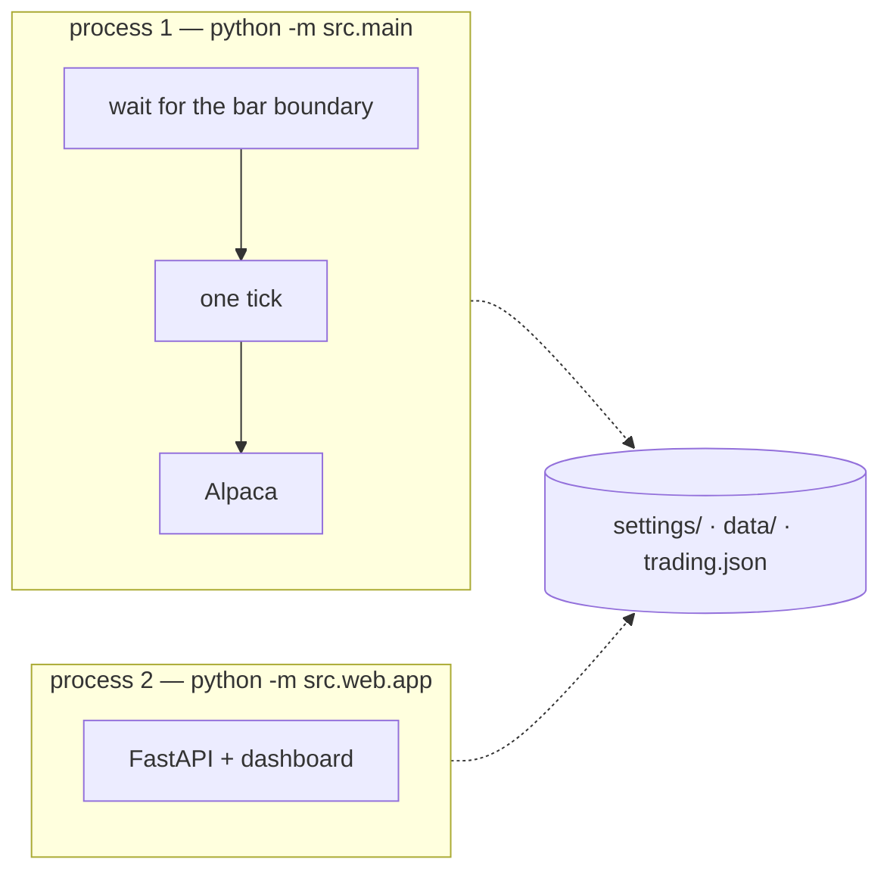

# TRAIDER

A single-instrument, rule-based trading bot that is developed, backtested and
operated from one place: a FastAPI web portal on top of a pure-Python strategy
stack.

The central design rule is that **the backtest replays the same code the live
bot would run**. Data fetching, feature computation, signal generation,
position sizing and stop/take handling all live in
importable modules, and the backtest drives them directly - so a number in the
report describes the system that would actually trade, not a simplified
replay of it.

## Status

| Area | State |
| --- | --- |
| Data pipeline (OpenBB + yfinance, Parquet store, delta backfill) | done |
| Features, rule model, risk layer, backtest engine + Gate | done |
| Web portal (chart, config, backtest panel, report page) | done |
| Tests | 879 passing |
| Execution config — Alpaca broker, per-strategy paper/live, fail-closed | done |
| Trading on/off switch + the "no reconfiguration while trading is on" lock | done |
| Live order execution — order building, retries, brackets, cancel/flatten | done |
| Portfolio state (DynamoDB) | **not implemented** |
| The execution loop — `src/main.py`, a separate process | done |
| The dashboard's view of it — positions, orders, the trading log (`/log`) | done |

The current strategy **does not pass its own Gate yet** (see
[CHECKLIST.md](CHECKLIST.md) for the metrics). Treat every stored result as
research, not as an expectation.

## How it works

```
OpenBB/yfinance ──> canonical Parquet dataset ──> features ──> rule model
                        (data/historical)             │            │
                                                      └──────> signals
                                                                  │
                        ┌─────────────────────────────────────────┘
                        v
                 RISK LAYER  (exposure cap -> sizing -> stop / take)
                        │
          ┌─────────────┴──────────────┐
          v                            v
   BACKTEST (next-open fills)     EXECUTION (Alpaca paper / live)
          │                            │   ^ config + paper/live switch
          │                            │     + trading on/off lock done,
          │                            │     executor implemented
          v                            v
   report page + run store        the live tree in data/
```

Two consequences worth knowing:

- **A signal is not a trade.** The risk settings decide how big an entry is and
  when the position actually ends (stop, take profit, or the opposite signal).
  The chart, the backtest panel and the report all read the same layer's output,
  so they cannot disagree.
- **Every risk field is optional, and empty means NOT APPLIED** — in the backtest
  and in live/paper trading alike, because both read these same values. There is
  no master switch: `MAX_EXPOSURE_PERCENT` is the only one with a default (100 =
  the whole account), and stopping a trade on losses (`MAX_CONSECUTIVE_LOSSES`,
  `MAX_LOSS_PERCENT`) is collected but not yet applied — halting belongs to the
  execution loop, which is where the frequent decisions are. See
  [One strategy, two drivers](#one-strategy-two-drivers) for the sizing rule.

## Two processes

TRAIDER runs as **two processes that share files and nothing else**. Neither can
start or stop the other, and there is no in-memory state to keep in step: every
setting and every result is already a file, and the settings layer re-reads them
when they change (`src/config/effective.py` caches on file mtime).



|  | **The loop** — `src/main.py` | **The dashboard** — `src/web` |
| --- | --- | --- |
| Started by | `scripts/run-bot.sh` | `scripts/run-dashboard.sh` |
| Owns | the bar clock, the shared strategy machine, **every order** | HTTP: the UI, configuration, backtests, reports, and the read-only view of the loop (`Live` panel, `/log`) |
| Must never | serve HTTP | place an order, or start the loop |
| Reaches the other by | reading and writing files | reading files |

Why they are separate:

- **The dashboard is the window you debug a broken loop through.** If they shared a
  process, a wedged loop would take down the very screen you use to notice it.
- **The dashboard is restarted constantly** — during development, on every code
  edit. A restart there must never be able to restart trading.
- **Turning trading on does not start the loop.** The loop runs permanently and
  reads the switch before every tick, so ON is a flag the next bar picks up, and
  OFF takes effect at the next boundary without touching the network.

That is enforced, not just described: `src/main.py` refuses to start if the
 dashboard is loaded in its own process, `tests/test_architecture.py` fails if
any web module gains a path to the loop, and the loop holds a **lease**
(`data/loop.lock`) so a second one cannot start and place a second set of orders.
The lease declares the boundary the holder is sleeping until, so a crashed loop is
taken over at once while a live one is never taken over at all.

See [docs/execution-loop.md](docs/execution-loop.md) for the tick's order, the
gates, and the build plan.

## Requirements

- Python 3.9 (developed and tested on 3.9.6)
- No API key needed for the default setup - the data layer uses yfinance
- Alpaca **paper** API keys only if you want the bot to place orders - paper
  keys are free and available worldwide, and are not required to backtest or to
  use the portal

## Setup

```bash
python3.9 -m venv .venv
.venv/bin/python -m pip install --upgrade pip
.venv/bin/python -m pip install -r requirements.txt

cp .env.example .env        # the defaults work as-is for a local, data-only run
```

`.env` holds ~50 settings; `.env.example` documents every one of them with
comments. Real values never leave your machine - `.env` is gitignored, and the
template ships with every credential blank.

## Run it

Two processes, two terminals — see [Two processes](#two-processes):

```bash
./scripts/run-dashboard.sh        # -> http://127.0.0.1:8000
./scripts/run-bot.sh              # the trading loop (add --once to run a single tick)
```

Both are thin wrappers around `python -m src.web.app` and `python -m src.main`,
run from the repo root. uvicorn directly works too —
`.venv/bin/python -m uvicorn src.web.app:app --host 0.0.0.0 --port 8000` — it just
skips the startup banner. There is no `--reload` anywhere on purpose: this process
is restarted often during development, and must never be able to restart trading.

Use `.venv/bin/python` explicitly; a bare `python` may resolve to a different
interpreter.

The portal is the whole interface:

- **Strategy bar** - switch, create, rename or delete a strategy (each one has
  its own instrument, bar size, rules and risk settings)
- **Trading switch** (header, left, beside the account) - the master ON/OFF for the
  active strategy, and the only place trading is started. Starting it always asks
  first, on paper as well as live: starting the bot is a deliberate act either way,
  and a confirmation that only appears sometimes is one you stop reading. The
  wording is what differs - on the live account it is about real money, on paper it
  is about the strategy acting on the next signal. Stopping never asks, so it is
  always one click.
- **Environment dropdown** (header, left, beside the logo) - which Alpaca account the
  active strategy's orders go to. It both selects and displays the mode, and the
  labels spell out the consequence rather than tinting the control: `Paper —
  simulated, no real money` / `LIVE — REAL ORDERS`. When the selected account has no
  keys, so orders would be refused, the label says so (`— ⚠ no keys`) and the
  tooltip carries the reason. Paper vs live is per strategy, so one strategy can run
  on the live account while another stays on paper. Only a real gesture on the
  dropdown can change it: a browser-restored value (bfcache, back/forward, crash
  recovery) fires `change` without anyone choosing anything, so it is ignored and
  the display snaps back to what the server said. That guard is released after every
  handled change, on blur, and by a timeout, so it protects the control without
  becoming a latch — and while a gesture is in flight the control is left completely
  untouched, because the status dots live in the option TEXT and rewriting a
  `<select>` under its open popup cancels the menu (macOS renders it natively). The
  dots pause for that moment; the click lands.
- **Trading panel** (appears under the chart while trading is ON) - a standing
  reminder that the strategy is armed, with a one-click stop. While it is
  visible every configuration surface is locked and the backtest buttons are
  disabled: nothing that would change what the bot is running may be edited
  mid-flight.
- **Price chart** - candles, indicators, BUY/SELL markers, the held-period
  bands (green when the round trip made money, red when it lost) and the
  stop/take exits
- **Strategy Configuration / Rules / Risk Management** - three collapsible
  panels; the risk panel leads with the two master switches. The Instrument group
  reads **bar size first, then historical period**, because the period's options
  depend on the bar size: a finer candle cannot reach as far back before the data
  provider stops serving intraday bars, so 1-minute bars offer 15–30 days,
  hourly bars 1–2 years and daily bars 2–5 years (the table lives in
  `src/config/history.py`). Choosing a bar size the stored period cannot be paired
  with moves the selection onto that bar size's own list — the panel cannot submit
  a pair the rule forbids. Both settings are one value each: the period carries its
  unit (`2y`, `30d`), so a window can never be half-specified in two places.
  **Market timezone** is a dropdown of the exchanges the bot can be pointed at —
  Nasdaq/NYSE (`America/New_York`), Frankfurt (`Europe/Berlin`) and London
  (`Europe/London`) — rather than free text, because the zone is what the trading
  hours, chart timestamps and period windows are measured in, and a typo there would
  be silent. The **trading window** is a bound on decisions, not a note: an intraday
  bar whose own timestamp is outside `TRADING_START_HOUR`–`TRADING_END_HOUR` produces
  no signal at all, so neither a backtest nor a live tick can act on a pre-market,
  after-hours, overnight or weekend bar. Daily bars are exempt — a daily bar *is* a
  session, so there is no clock time to compare. One rule, in
  `src/config/session.py`, is shared by the decision filter and the live poll, so the
  bot can never fetch a bar it refuses to decide on (or decide on one it would not
  fetch). There is no **Model** group: rule-based is the only model implemented
  (the backtester and the signal service both refuse to run under any other), so
  `MODEL_TYPE` and its thresholds are set in `.env` and are no longer per-strategy.
- **Account Settings** (🏦 header popup) - the Alpaca key pairs, the single data
  folder and the backtest costs; shared by all strategies. Three sections and nothing
  else — what belongs to a *trading account*. The history window, the backtest window
  and the train/test split are gone (the strategy's period and bar size answer the
  first, a run is triggered by hand and covers the strategy's whole period, and the
  only model in use is rule-based), and so are cloud storage and state persistence:
  those are infrastructure — one dataset copy per bucket, one state table per
  deployment — and neither is being developed, so they are configured in `.env` when
  they are. A
  stored secret is shown as `********` **in the box**, not as a grey hint behind an
  empty one, so "is a pair saved?" is answerable at a glance — an empty box with a
  faint placeholder read as "nothing was saved" even for a pair that had just been
  verified. Submitting the mask back means "unchanged", on every write path. Each
  key pair has a **Validate** button, which checks **only what the boxes contain**
  (untyped-but-unsaved included) - an empty form is answered with "no credentials
  found to validate" rather than quietly checking the stored pair, so the reply is
  always about a key that is on screen. Saving is the other way round: a blank or
  masked field there means "unchanged". The badge is the
  **result of a check, not stored state**: the rows are clean when the popup opens,
  and a pair is labelled only once it has been checked in that visit - by Validate
  (`✓ verified · <account> · <time>`, or `⚠ not valid` with the reason on hover) or
  by the check a save runs on a newly added pair. A stored verdict is not painted on
  open, because a masked box with "⚠ not valid" beside it reads as a bug rather than
  as news. A pair that already passed is not re-checked on every save. A bad pair
  fails itself rather than the save: a pair the broker **rejects** is left out of the
  write (see Safety) while the rest of the form is saved as normal.
- **Global settings** - not in the dashboard any more: the data provider, its keys
  and the rest of the infrastructure settings are edited in `.env` directly
- **Backtest panel** - run the engine, read the Gate and the metrics
- **Historical Delta** - gap-check the dataset against the provider and refill
  missing bars
- **Report page** - the full picture for any stored run: equity vs buy & hold,
  drawdown, monthly/yearly returns, the trade distribution, the exit-reason
  breakdown and the entries the risk layer refused
- **Market page** (`/market`, 🌎 header button) - whole-market screening from
  Yahoo Finance: a preset screener, the whole US market, top gainers, highest
  volume, top losers and the small-cap gainers/volume lists. The two long tables
  are collapsible and start collapsed so the page opens as an overview
- **Live panel** (left column, directly under Backtest; click the header to expand) - whether
  a loop is running the active strategy, what it last did and when, whether anything open is
  actually **protected** by a resting exit, and whether the **exchange is open** —
  with the time it next changes. That last line is read from Alpaca's clock rather
  than inferred from the last tick, so it answers "do I need to come back, and
  when?" even before the loop has ever run; when the clock cannot be read it says
  so instead of guessing, because "closed" and "we could not look" are different
  answers. It also leads with **what the account is worth** — equity, the day's
  change and its percentage, cash and buying power — for the environment being
  traded. An account that could not be read shows its reason in place of the
  numbers, never `$0.00`: a balance and an absence of one are different answers.
- **The log page's Account card** shows the same numbers for **both**
  environments, one row each, directly comparable — because a strategy trades one
  account at a time while a person can be wrong about which. The account number is
  masked to its last three characters (enough to tell two accounts apart, and no
  more), and the broker's payload is never proxied to the browser.

**The dashboard does not reload itself, and what it does refresh is deliberate.**
The Live panel polls only while it is expanded *and* the tab is in the foreground:
the loop's own records every 5 s (local files) and the account plus the exchange
clock every 60 s (broker calls). Opening it, or coming back to the tab, refreshes at
once. A poll that changes nothing rewrites nothing, so the panel does not churn
while you read it. Collapse it, or leave the tab, and the polling stops — a
background tab asking Alpaca every minute is a recurring cost with no reader. The
trading log page refreshes itself only while **today** is showing, since a past day
cannot gain rows, and its ↻ button re-reads the day you are looking at. Everything
else is on demand.

The two header controls are **one pill in every state** - same border, radius,
padding, height, font, tint, background and text colour, whichever account is
selected and whether or not trading is on. Nothing is styled per state, and the
class list is constant, so the pair cannot drift apart; the state is carried by the
words (`LIVE — REAL ORDERS` next to `▶ Turn trading on`) rather than by a palette
you have to remember. The dropdown is forced into the button's box for this: no
caret, the same 34px height, and its label centred like the button's.

Each label ends with a **status dot**: blue for the calm state (paper account,
trading off), and a red one that blinks for the state that spends money or is live
(live account, trading on). Both dots are driven by one clock, so when both are red
they blink in step. A dot is part of the TEXT rather than a styled element: the
account control is a native `<select>`, whose options can only hold text and which
always sizes itself to its widest option, so a positioned element could never sit
at the end of the selected label. Under `prefers-reduced-motion: reduce` the alert
dot stays red and simply stops flashing.

## Tests

```bash
.venv/bin/python -m pytest tests/ -q      # 508 passed
```

The suite is offline: OpenBB, the broker and the clock are all stubbed, so it
runs without credentials or market data. The dashboard's and report page's
crosshair-sync logic is exercised by running the real `app.js` / `report.js`
blocks under `node` against fake charts that reproduce lightweight-charts'
actual event semantics (see `tests/test_web/test_crosshair_sync.py`), so it needs
`node` on `PATH`; those tests skip themselves when it is absent.

## Project layout

```
src/
  config/      settings (pydantic) + per-strategy effective settings
  data/        OpenBB client, provider session, screener (Yahoo), dataset, delta backfill
  features/    indicators + feature engineering (no lookahead)
  model/       rule store and rule-based signal generator
  risk/        position sizing and stop/take levels (plus an unwired validator)
  backtest/    engine, metrics + Gate, risk replay, report analytics, run store
  execution/   Alpaca executor, broker seam, positions reader, live store
  state/       portfolio tracker      (not implemented — the live store holds the position)
  scheduler/   the loop: orchestrator (tick + run), host (lease, startup), lease
  logging/     structured logging, alerts (not implemented)
  web/         FastAPI app, routes, services (incl. the trading lock), templates, static assets
  main.py      THE LOOP's entry point (the other process)
tests/         pytest suite (offline)
settings/      LOCAL DATA (gitignored): strategies/store.json + account/account.json
data/          generated at runtime: historical Parquet, backtest results, the live tree,
               and loop.lock (the lease)
```

`src/config/` also holds the runtime state **both processes read**: the switch
(`trading_state`) and the loop's lease (`loop_state`). They live below `src/web` and
`src/scheduler` on purpose, so the dashboard can answer "is the bot running?" without
importing the loop — the invariant `tests/test_architecture.py` enforces.

Runtime data is not in the repository:

```
data/historical/<SYMBOL>_<bar>.parquet         canonical OHLCV
data/backtest_results/<strategy>/latest.json   trimmed view the panel reads
data/backtest_results/<strategy>/runs/<id>.json full, self-describing run
data/backtest_results/<strategy>/index.json    run-menu index
data/trading.json                              trading ON/OFF (runtime, not config)
```

The trading state is deliberately **not** configuration: it lives beside the
datasets because the configuration files it freezes cannot hold the switch that
freezes them.

A run file is deliberately complete: every equity point, every trade with its
exit reason, and an `inputs` block (settings, rules + fingerprint, window,
costs, risk config) that makes a result reproducible and attributable.

## Configuration

Three layers, two editors in the dashboard:

| Layer | File | Edited from | Holds |
|-------|------|-------------|-------|
| **Global** | `.env` | by hand | data provider + keys, the paths of the two JSON stores, cloud storage (read by the dataset sync, off by default) and state persistence (unbuilt) |
| **Account** | `settings/account/account.json` | 🏦 Account Settings | the Alpaca key pairs (paper + live), the data folder, backtest costs |
| **Strategy** | `settings/strategies/store.json` | Strategy Configuration / Rules / Risk panels, plus the header dropdown for `EXECUTION_ENV` | instrument, bar size + history period, trading hours + exchange, features, gates, schedule, risk limits, rules, paper/live |

Precedence is **strategy > account > .env**, and the process environment still
wins over `.env` (which is why a stray exported variable can silently override
it). Both JSON files are LOCAL DATA: gitignored, and created on first save.

One key is stored per strategy but edited outside the panels: `EXECUTION_ENV`
comes from the header dropdown. Saving a panel preserves it (the panel never
renders it, so a plain Save would otherwise reset a live strategy to paper).

A fresh clone has **no strategy store**: the app starts with an empty one and
the portal shows its "create your first strategy" form. Point
`STRATEGY_RULES_FILE` somewhere else if you keep yours outside the repo.

The Gate thresholds (`GATE_MIN_SHARPE`, `GATE_MAX_DRAWDOWN_PERCENT`,
`GATE_MIN_WIN_RATE_PERCENT`, `GATE_MAX_WEEKLY_LOSS_PERCENT`) are part of the
configuration, not the code - a strategy is judged against the bar you set.

## One strategy, two drivers

The rules that decide a trade live in exactly **one** place, whether the bar is
being replayed from the past or arriving from the market:

```mermaid
flowchart LR
    D["OpenBB candles"] --> F["FeatureEngineer<br/>+ rule set"]
    F -->|Signal per bar| E["StrategyEngine<br/>src/strategy/engine.py"]
    S["StrategyState<br/>position · last bar"] <-->|step(state, bar, act)| E
    E -->|Intent| B{{"Broker seam<br/>src/strategy/broker.py"}}
    B --> SB["SimulatedBroker<br/>backtest"]
    B --> AB["AlpacaBroker<br/>paper / live (to be written)"]
    SB --> L["Ledger<br/>returns · legs · stats"]
    AB --> L
```

| Module | Role |
| --- | --- |
| `src/strategy/engine.py` | every trading rule: entry, exit, stop/take levels, sizing, costs. Pure — it reads bars and an action, and returns an `Intent`; it never fetches, sleeps or persists |
| `src/strategy/state.py` | what a run must remember across bars (the position, the last decided bar) and how it survives a restart |
| `src/strategy/broker.py` | the only seam between "decide" and "act": `SimulatedBroker` fills at the next open, `AlpacaBroker` will place real orders |
| `src/strategy/live.py` | the live driver: feed it closed candles, it evaluates features, walks the engine from where it left off, submits intents and books the fills |
| `src/backtest/risk_sim.py` | a translation layer only — it turns the backtest's arrays into `Bar`s and drives the same engine. It holds no decision of its own, and the raw replay (`simulate_frame`, `position_intervals`) now goes through it with the risk layer off |
| `tests/test_strategy_parity.py` | the guarantee itself (below) |

**Neither driver may contain a trading rule.** A driver's job is to supply bars
and to carry out intents. If a rule ever appears in one of them, the backtest
stops being evidence about the live run, which is the entire point of this
layout.

### How the guarantee is checked

`tests/test_strategy_parity.py` runs both drivers over the same fixture and
demands they agree bar by bar: the same entry and exit indices, the same fill
prices, the same reasons, the same skipped trades, the same protected window, the
same refusal when the broker disagrees with local state, the same breaker halt.
It also asserts, by monkeypatching `StrategyEngine.step`, that **both** paths
actually call the shared machine — a driver that quietly grew its own logic
fails the test rather than drifting for a year. It found two real bugs when it
was written: a held position was never checked against its stop (the entry path
returned early), and the live driver booked trades without a date, so its
engine's trade was booked undated, which the (then) breaker needed.

The one deliberate asymmetry is the **fill price**: a backtest fills at the next
bar's open and can assume no slippage beyond the configured cost, while a live
order fills where the market fills. That is why the data flows through a broker
object rather than being hard-coded, and why the live driver *adopts* the real
fill price and re-derives the stop levels from it, leaving the recorded
"expected" price intact for comparison.

### One consequence worth knowing

A live run must be handed enough history to compute its features. The number of
bars is **derived from the feature configuration** (`required_bars` in
`src/data/live.py`: the configured `FEATURES_MIN_LOOKBACK` or the longest enabled
indicator window, plus one bar of context for cross rules), never guessed — a run
handed too few bars evaluates NaN indicators and would emit `HOLD` forever,
which looks exactly like a quiet market. `LiveDriver.check_history` refuses to
decide instead, loudly.

## Order execution

`src/execution` is the only part of TRAIDER that can move money, and it is layered so
each question is answered in exactly one place:

| Module | The question it answers |
| --- | --- |
| `config.py` | *Where* would an order go — paper or live? Resolved once; raises rather than downgrading |
| `credentials.py` | Are the keys **working**, or merely present? Asked of Alpaca, never inferred from the file |
| `alpaca_client.py` | The API in URLs and status codes: auth headers, timeouts, what is retryable |
| `retry.py` | May this call be tried again? Only a failure that never reached a verdict |
| `alpaca_executor.py` | Place ONE order: refuse before sending, bracket the exits, poll, report |
| `alpaca_broker.py` | The strategy's `Broker` seam: an `Intent` in, a `Fill` out |

Five decisions worth knowing about:

- **Refuse before sending, never after.** Four checks run first — the configuration,
  the trading switch, the numbers, and the risk layer — and all four raise
  `OrderRefused` with nothing sent. An order that is never sent is the only kind that
  cannot be wrong.
- **The exits ride on the entry.** A stop and a take-profit go out as Alpaca's
  `bracket` order class in the *same* call. Sending them afterwards is the classic way
  to leave a position naked, or to leave a filled take-profit's twin stop resting to
  open the opposite position.
- **A retry reuses its `client_order_id`.** A submit that times out may have been
  received; Alpaca deduplicates on that id, so a retry cannot double-fill. And only
  retryable failures are retried — a revoked key (401/403) or a bad order (4xx) is
  reported instead.
- **A timeout is reported, not retried, and a live order is never mistaken for a
  fill.** An order that has not filled comes back as `NO_FILL` with its real status,
  so a run never books a price the broker did not give.
- **An exit may have already happened.** In a live run the resting bracket can close a
  position before the strategy's next bar notices. The broker then reports it as
  closed, at the price read back from its own order history, and cancels any surviving
  leg — never re-deriving the price locally.

## Documentation

| File | What it is |
| --- | --- |
| [QUICKSTART.md](QUICKSTART.md) | the phased build plan, with progress |
| [CHECKLIST.md](CHECKLIST.md) | task-by-task status, the Gate numbers and the open work |
| [TRAIDER_PLAN.md](TRAIDER_PLAN.md) | the architecture and design decisions |
| [DEPENDENCY_GRAPH.md](DEPENDENCY_GRAPH.md) | module dependency graph |
| [DOCUMENT_INDEX.md](DOCUMENT_INDEX.md) | index of every document |
| [SUMMARY.txt](SUMMARY.txt) | short summary of the project |
| [.github/skills/](.github/skills) | task-scoped notes (OpenBB, backtesting, features, risk, Alpaca) |

## Safety

- **The order path exists, and nothing calls it yet.** `src/execution` can place a
  bracket order in either environment, and the live driver
  (`src/strategy/live.py`) is written against the same broker seam — but no
  scheduler starts it, so orders only go out if something explicitly runs a tick.
  Turning trading on is the gate that must be open first, in both environments.
- **Trading starts OFF, and going live is refused rather than downgraded.**
  Turning trading on is refused outright while the selected Alpaca account has no
  API keys for it (otherwise "trading on" would be a lie), and it is confirmed on
  the switch itself every time - the live prompt is about real money, the paper one
  about the strategy starting to act. Silently falling back to paper would either
  hide a broken live setup or spend real money. The header pills say which account
  and whether trading is on, and each run's `inputs.execution` records which
  environment was in play.
- **Keys must be verified, not just configured.** The environment in play is
  re-checked against the broker (`GET /v2/account`, one call) **every time trading is
  turned on**, paper and live alike, whether or not a verdict is on file. Presence
  proves nothing: keys get copied from the wrong account page, revoked, or paired
  with the other environment's secret, and every one of those would previously have
  shown a green "trading ON" while every order bounced off a rejected key. A stored
  pass is not enough on its own either, because a key can be **revoked between two
  clicks** without its fingerprint changing — so the switch asks again rather than
  trusting what it was told earlier, and a failed re-check leaves trading OFF and
  says why. An unreachable broker counts as failure: a key we cannot prove is not a
  key we can claim to trade with. The verdict is per environment and belongs to the
  KEY that earned it, so swapping keys expires it automatically; a pass is cached
  for display and saves - editing an unrelated setting does not re-ask Alpaca - while
  a failure is not, since it may just be the network.
- **A process older than its own source says so.** Python loads a module once, so a
  server started before an edit keeps enforcing the previous gate — the dashboard,
  the popup and the tests all look current while the thing deciding whether orders
  may start is not. The gate modules are watched by mtime and the trading payload
  carries the verdict: the switch's tooltip says so, and the dashboard warns once per
  page load, naming the files that moved on without it. Restart uvicorn to clear it.
- **A key pair the broker rejects is never written down.** Saving the account form
  checks the pairs it is about to add or change, and a pair Alpaca answers 401/403
  for is left out of the account file: a stored credential that cannot work would
  make the file claim something untrue and push the failure to some later, less
  obvious moment (the first order, say). Everything else in that save lands — one bad
  pair is not a reason to discard the data folder, the S3 settings and the backtest
  defaults that arrived with it — and the popup names the pair it left behind. A pair
  that could not be *reached* is saved unproven instead, because a network problem is
  not evidence about a credential.
- **Paper is always the default.** Credentials for a live account do not move the
  switch, and neither does re-using an existing strategy: routing orders to a real
  account is an explicit choice, made in the header dropdown, per strategy.
- **No reconfiguration while trading is on.** With trading on, the server refuses
  every configuration write with HTTP 409 - settings, account, rules, strategy
  create/rename/delete/select, the backtest runner, the dataset rebuild/backfill
  and the delta sync - and the UI disables the matching buttons. A stale browser
  tab or a scripted POST cannot reconfigure a strategy mid-flight. Reads stay
  available, and turning trading off is always allowed: that is the only action
  that releases the lock, so it must not depend on the configuration it freezes.
- Keep credentials in `.env` (gitignored) or a secret manager - never in code.
  Both the account file and the trading state file are written owner-only (0600).
- A backtest is not a forecast. The Gate exists to stop a strategy that has not
  earned capital, and passing it is a floor, not a promise.
- Paper results are optimistic: the paper engine simulates no slippage, fees or
  dividends, so it will beat both your backtest and live.
- This is a personal engineering project, not financial advice.
